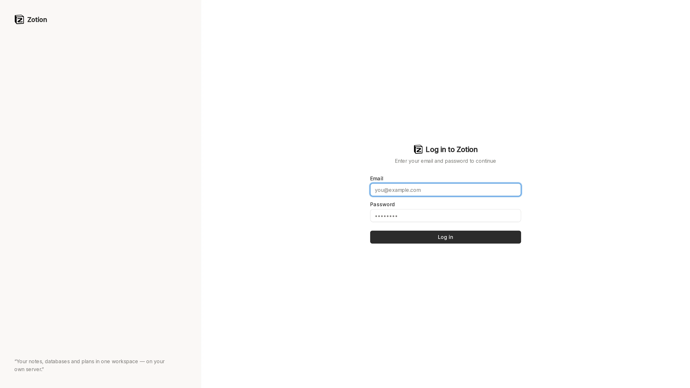
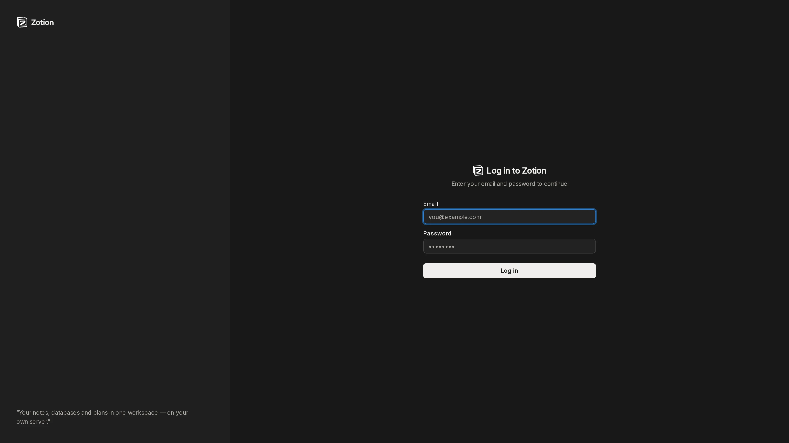
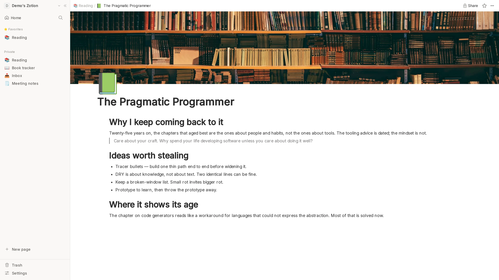
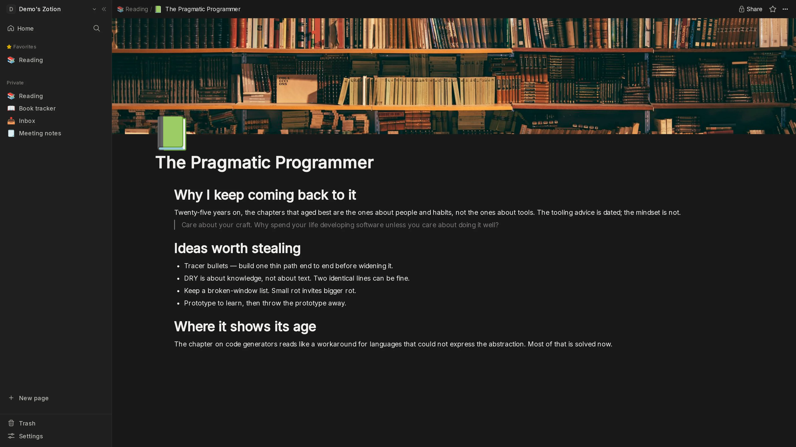
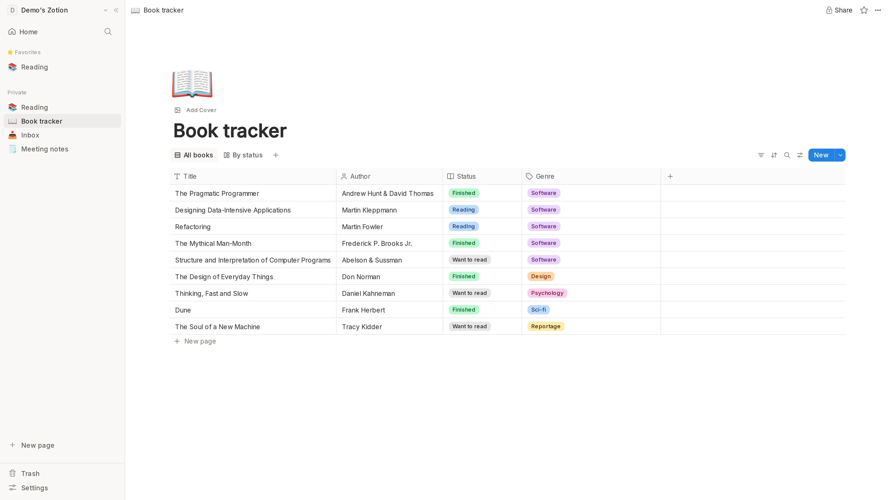
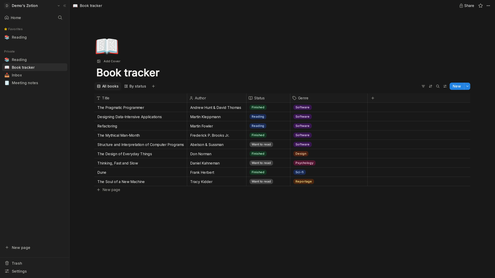
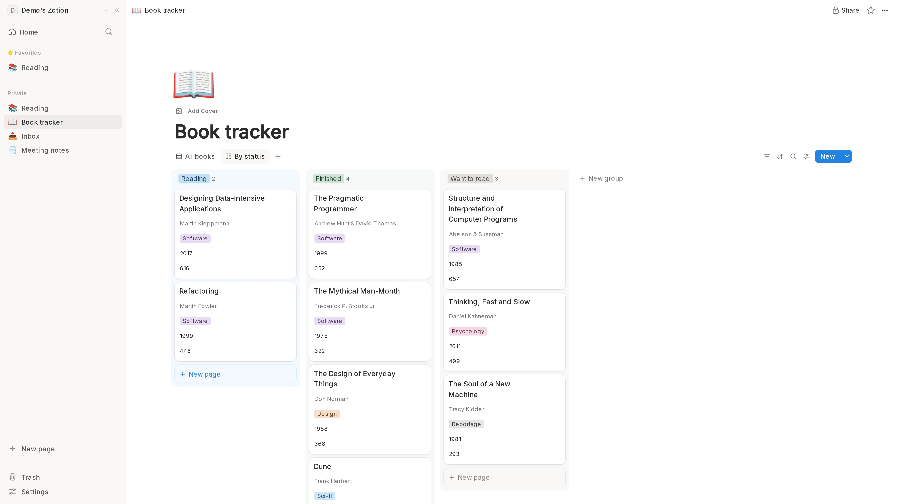
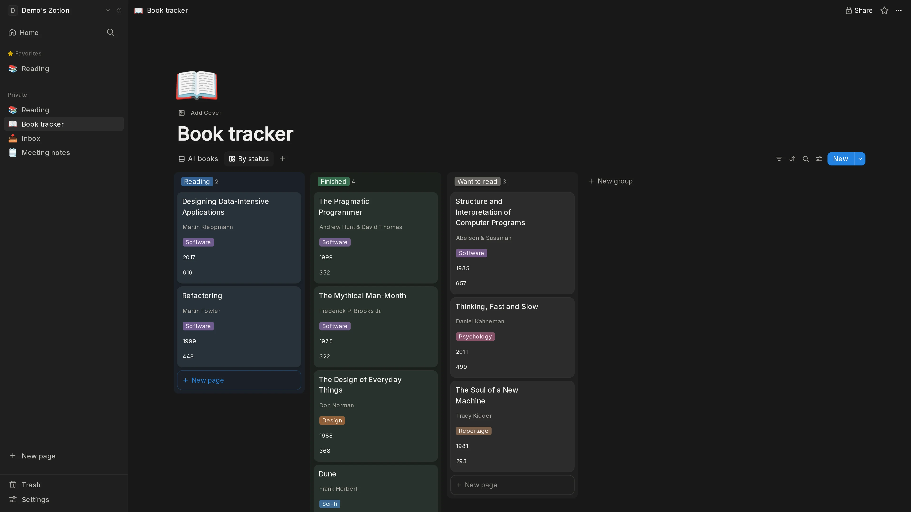

<div align="center">


<h1>Zotion</h1>

<p><strong>Your workspace. Your server. No SaaS.</strong><br>
A self-hostable Notion alternative — nested pages, a real block editor, and
databases with table and board views.</p>

<p>


</p>

<p>
<a href="#-screenshots">Screenshots</a> ·
<a href="#-features">Features</a> ·
<a href="#-getting-started">Getting started</a> ·
<a href="#-documentation">Docs</a>
</p>

<p><a href="README.tr.md">🇹🇷 Türkçe README</a></p>

</div>

---

## 📸 Screenshots

<!-- SCREENSHOTS:START -->

<!-- Generated by `npm run screenshots` · 2026-08-25 · 1920x1080@2x · do not edit by hand -->

#### Sign in

What a signed-out visitor lands on.



<details>
<summary>Dark mode</summary>



</details>

#### Pages and the editor

A nested page with a cover, an icon and real notes — sidebar, breadcrumb and editor as they actually render.



<details>
<summary>Dark mode</summary>



</details>

#### Databases — table view

A book tracker: title, author, a select and a multi-select over nine books.



<details>
<summary>Dark mode</summary>



</details>

#### Databases — board view

The same rows grouped by the status property, saved as a second view.



<details>
<summary>Dark mode</summary>



</details>

<!-- SCREENSHOTS:END -->

---

## ✨ Features

Everything you'd expect from a modern workspace, running on hardware you control.

### 📝 Writing

- **Real block editor** — headings, lists, quotes, code blocks, images and tables,
  powered by [BlockNote](https://blocknote.dev).
- **Infinite nesting** — pages inside pages, as deep as your thinking goes.
- **Covers and icons** — give every page a face; drag the cover to reposition it.
- **Reading experience your way** — full width, small text, table of contents, and a
  selectable editor font, per page.
- **Focus mode** — everything but the words gets out of the way.

### 🗂️ Databases

- **Table and board views** over the same rows — each view saved with its own
  filters, sorts and visible columns.
- **Rich property types** — text, select, multi-select, number, checkbox, date, url,
  email, phone, person, relation, formula and files.
- **Group by anything** — turn a board into a kanban on any select property, and
  reorder cards by dragging.
- **Rename without fear** — columns are keyed by id, so renaming one never touches
  your data.

### ⚡ Everyday flow

- **Real-time everywhere** — edits land instantly across every tab and device.
- **Full-text search** — across titles and page content, with a title-only filter.
- **Favourites and a sidebar you can shape** — drag to reorder, collapse to focus.
- **A trash that forgives** — soft delete with a 30-day window, and one-click restore.
- **Light and dark** — a theme for every hour, matched to your system by default.
- **Mobile ready** — the whole workspace, down to phone width.

### 🔐 Yours, and only yours

- **Publish to the web** — turn any page into a read-only public link, instantly.
- **Private by default** — every read and write is authorized on the server, not in
  the browser.
- **Files never leak** — uploads stream through the app; the storage bucket is never
  public.
- **One image, any domain** — move to a new hostname and your pages, covers and links
  keep working.

---

## 🚀 Getting started

Everything runs from a single `docker-compose.yml` and keeps its state in named
volumes. Nothing phones home.

```bash
git clone https://github.com/YakupEmreYerli/notion-clone.git
cd notion-clone
cp .env.example .env      # set APP_URL + NEXT_PUBLIC_CONVEX_URL, generate secrets
docker compose up -d --build
```

Then generate a Convex admin key and push the backend functions:

```bash
docker compose exec convex-backend ./generate_admin_key.sh
# paste it into .env as CONVEX_SELF_HOSTED_ADMIN_KEY, then:
docker compose up convex-deploy
```

Open `APP_URL`, create your account, and start writing.

> Deploying behind Dokploy, Traefik or another reverse proxy?
> See the [self-hosting guide](docs/self-hosting.md).

### What runs where

| Concern | Service |
|---|---|
| Real-time database | [self-hosted Convex](https://github.com/get-convex/convex-backend) |
| Authentication | [Better Auth](https://better-auth.com) (email + password), on Postgres |
| File and cover storage | [MinIO](https://min.io) or any S3-compatible bucket |
| App | Next.js 16, from a standalone Docker image |

---

## 📚 Documentation

| Guide | What's inside |
|---|---|
| [Self-hosting](docs/self-hosting.md) | Full Docker Compose walkthrough, Dokploy, reverse proxy, volumes |
| [Development](docs/development.md) | Local setup and the script reference |
| [Docs index](docs/README.md) | Everything else |

## 🙏 Acknowledgements

Originally based on [CodeWithAntonio](https://www.youtube.com/@codewithantonio)'s
Notion clone, since rebuilt on a fully self-hosted stack.

## 📄 License

[MIT](LICENSE)
