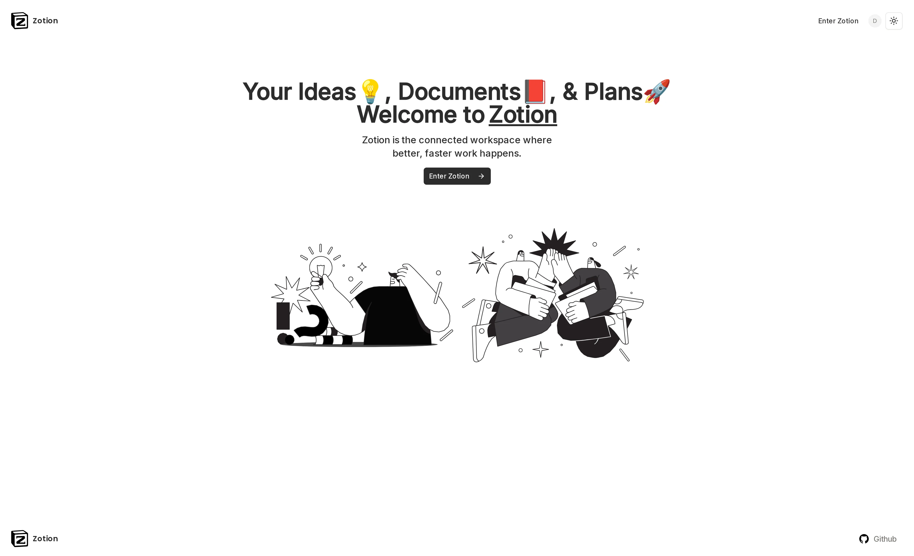
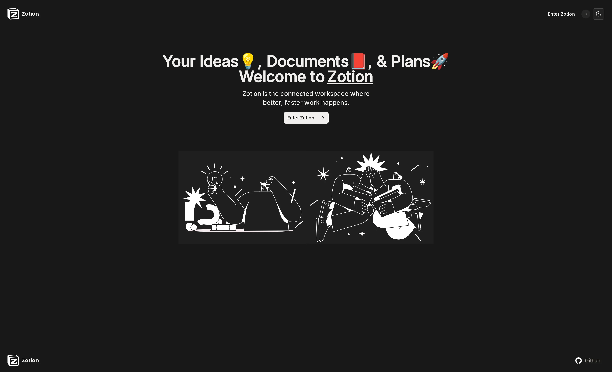
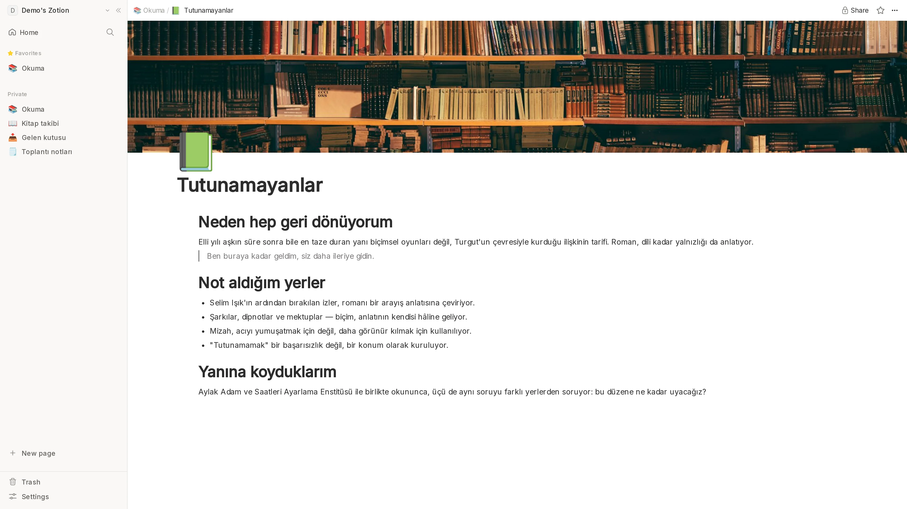
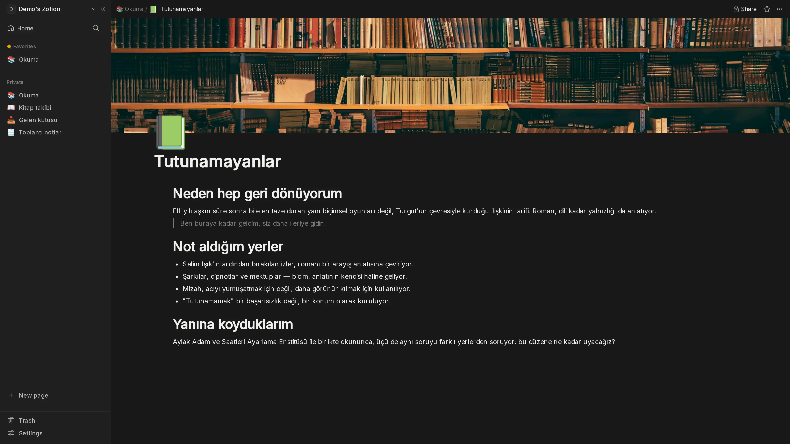
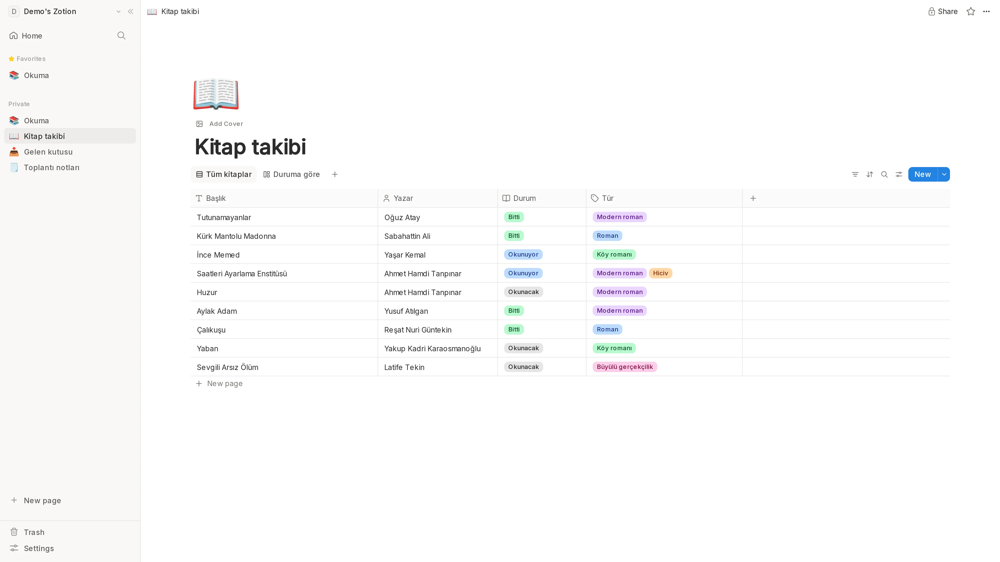
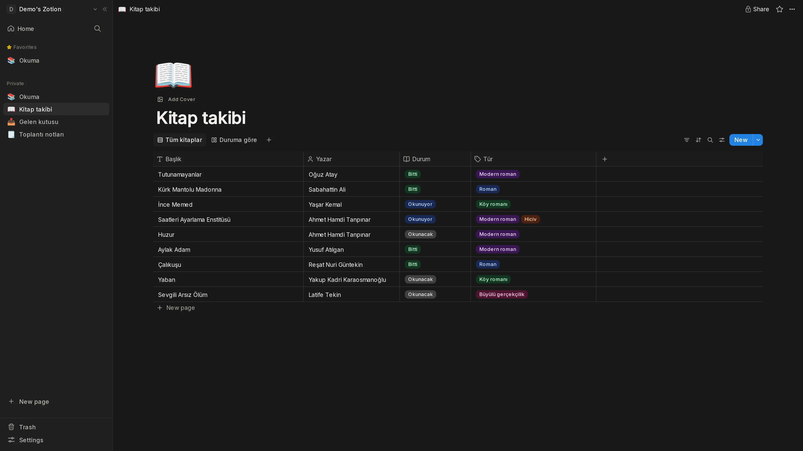
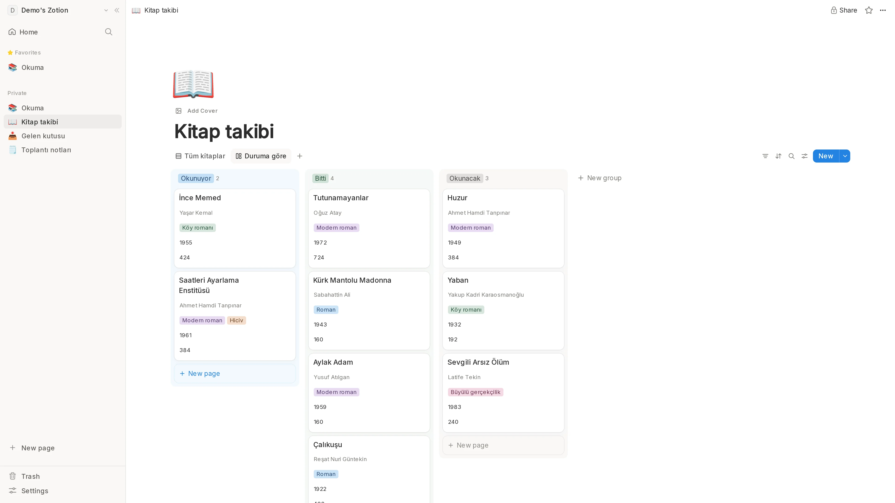
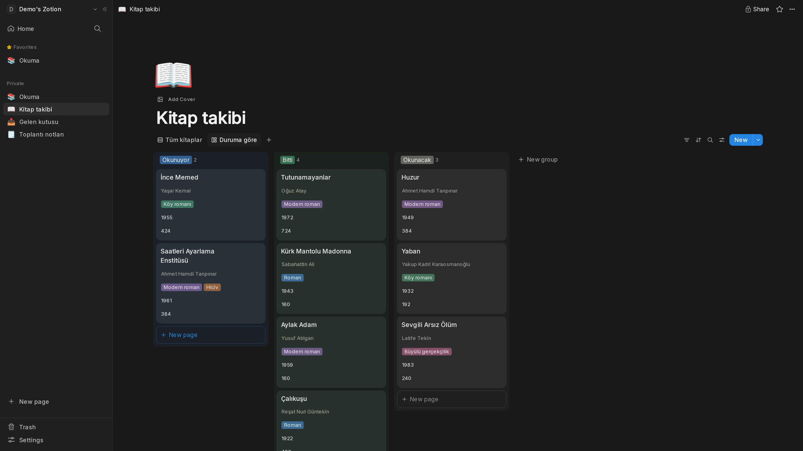

<div align="center">


<h1>Zotion</h1>

<p><strong>Kendi çalışma alanın. Kendi sunucun. SaaS yok.</strong><br>
Kendi sunucunda barındırabileceğin bir Notion alternatifi — iç içe sayfalar,
gerçek bir blok editörü, tablo ve board görünümlü veritabanları.</p>

<p>


</p>

<p>
<a href="#-ekran-görüntüleri">Ekran görüntüleri</a> ·
<a href="#-özellikler">Özellikler</a> ·
<a href="#-hızlı-başlangıç">Hızlı başlangıç</a> ·
<a href="#-dokümantasyon">Dokümanlar</a>
</p>

<p><a href="README.md">🇬🇧 English README</a></p>

</div>

---

## 📸 Ekran görüntüleri

<!-- SCREENSHOTS:START -->

<!-- `npm run screenshots` tarafından üretildi · 2026-08-24 · 1920x1080@2x · elle düzenlemeyin -->

#### Karşılama sayfası

Giriş yapmamış bir ziyaretçinin gördüğü sayfa.



<details>
<summary>Koyu tema</summary>



</details>

#### Sayfalar ve editör

Kapağı, ikonu ve gerçek notları olan iç içe bir sayfa — sidebar, breadcrumb ve editör göründükleri hâliyle.



<details>
<summary>Koyu tema</summary>



</details>

#### Veritabanları — tablo görünümü

Kitap takibi: dokuz kitap üzerinde başlık, yazar, select ve multi-select.



<details>
<summary>Koyu tema</summary>



</details>

#### Veritabanları — board görünümü

Aynı satırların durum property'sine göre gruplanmış hâli; ikinci bir kayıtlı görünüm.



<details>
<summary>Koyu tema</summary>



</details>

<!-- SCREENSHOTS:END -->

---

## ✨ Özellikler

Modern bir çalışma alanından beklediğin her şey — üstelik senin kontrolündeki
donanımda çalışıyor.

### 📝 Yazma

- **Gerçek blok editörü** — başlıklar, listeler, alıntılar, kod blokları, görseller
  ve tablolar; [BlockNote](https://blocknote.dev) ile.
- **Sonsuz iç içelik** — sayfa içinde sayfa, düşüncen nereye kadar giderse.
- **Kapaklar ve ikonlar** — her sayfaya bir yüz ver; kapağı sürükleyip konumlandır.
- **Okuma deneyimi senin bildiğin gibi** — sayfa başına tam genişlik, küçük yazı,
  içindekiler tablosu ve seçilebilir editör yazı tipi.
- **Odak modu** — kelimeler dışında ne varsa aradan çekilir.

### 🗂️ Veritabanları

- **Aynı satırlar üzerinde tablo ve board görünümleri** — her görünüm kendi
  filtresi, sıralaması ve görünür sütunlarıyla kaydedilir.
- **Zengin property türleri** — text, select, multi-select, number, checkbox, date,
  url, email, phone, person, relation, formula ve files.
- **İstediğin şeye göre grupla** — herhangi bir select property'sinden kanban çıkar,
  kartları sürükleyerek sırala.
- **Korkmadan yeniden adlandır** — sütunlar id ile anahtarlanır, adı değiştirmek
  verine asla dokunmaz.

### ⚡ Günlük akış

- **Her yerde gerçek zamanlı** — düzenlemeler tüm sekmelere ve cihazlara anında iner.
- **Tam metin arama** — başlıklarda ve sayfa içeriğinde, yalnızca-başlık filtresiyle.
- **Favoriler ve şekillendirebildiğin bir sidebar** — sürükleyip sırala, daraltıp odaklan.
- **Affeden bir çöp kutusu** — 30 günlük pencereyle yumuşak silme, tek tıkla geri alma.
- **Açık ve koyu tema** — her saate bir tema, varsayılan olarak sisteminle uyumlu.
- **Mobil hazır** — çalışma alanının tamamı, telefon genişliğine kadar.

### 🔐 Senin, sadece senin

- **Web'e yayımla** — herhangi bir sayfayı anında salt okunur bir public linke çevir.
- **Varsayılan olarak gizli** — her okuma ve yazma tarayıcıda değil, sunucuda yetkilendirilir.
- **Dosyalar sızmaz** — yüklemeler uygulama üzerinden akıtılır; depolama bucket'ı asla public değildir.
- **Tek imaj, her domain** — yeni bir hostname'e taşın, sayfaların, kapakların ve
  linklerin çalışmaya devam etsin.

---

## 🚀 Hızlı başlangıç

Her şey tek bir `docker-compose.yml`'den çalışır ve durumunu adlandırılmış
volume'lerde tutar. Hiçbir şey dışarı veri göndermez.

```bash
git clone https://github.com/YakupEmreYerli/notion-clone.git
cd notion-clone
cp .env.example .env      # APP_URL + NEXT_PUBLIC_CONVEX_URL ayarla, secret'ları üret
docker compose up -d --build
```

Ardından bir Convex admin key üret ve backend fonksiyonlarını gönder:

```bash
docker compose exec convex-backend ./generate_admin_key.sh
# .env içine CONVEX_SELF_HOSTED_ADMIN_KEY olarak yapıştır, sonra:
docker compose up convex-deploy
```

`APP_URL`'i aç, hesabını oluştur ve yazmaya başla.

> Dokploy, Traefik ya da başka bir ters proxy arkasında mı dağıtıyorsun?
> [Self-hosting rehberine](docs/self-hosting.md) bak.

### Ne nerede çalışıyor

| Bileşen | Servis |
|---|---|
| Gerçek zamanlı veritabanı | [self-hosted Convex](https://github.com/get-convex/convex-backend) |
| Kimlik doğrulama | [Better Auth](https://better-auth.com) (e-posta + parola), Postgres üzerinde |
| Dosya ve kapak depolama | [MinIO](https://min.io) ya da S3 uyumlu herhangi bir bucket |
| Uygulama | Next.js 16, standalone Docker imajından |

---

## 📚 Dokümantasyon

| Rehber | İçinde ne var |
|---|---|
| [Self-hosting](docs/self-hosting.md) | Tam Docker Compose anlatımı, Dokploy, ters proxy, volume'ler |
| [Geliştirme](docs/development.md) | Yerel kurulum ve script referansı |
| [Doküman indeksi](docs/README.md) | Geri kalan her şey |

## 🙏 Teşekkürler

Başlangıçta [CodeWithAntonio](https://www.youtube.com/@codewithantonio)'nun Notion
klonuna dayanıyordu; sonrasında tamamen self-hosted bir stack üzerine yeniden kuruldu.

## 📄 Lisans

[MIT](LICENSE)
